# Ahti — a long-form writing studio for Mac, iPad, and iPhone

> **A quiet place to write a long book.** Ahti is a Scrivener-class writing studio — binder, corkboard, outliner, a full rich-text editor, snapshots, collections, writing targets, and a compiler that turns a manuscript into an ePub, Word document, or PDF — built on a plain-Markdown folder you fully own. It ships as a native macOS app, an iOS/iPadOS app, and also runs in the browser.

[**Mac App Store**](https://apps.apple.com/us/app/ahti/id6781643515?platform=mac) · [**iPhone & iPad**](https://apps.apple.com/us/app/ahti/id6781643515?platform=iphone) · [Support](https://www.bretmerritt.com/ahti) · [Documentation](https://www.bretmerritt.com/ahti/documentation) · [Privacy policy](https://www.bretmerritt.com/ahti/privacy-policy)

This repo is an overview of a closed-source project: the README covers what Ahti is, how it's built, and the problems solved along the way. The source is private — I'm happy to walk through it in an interview.

<p align="center">
  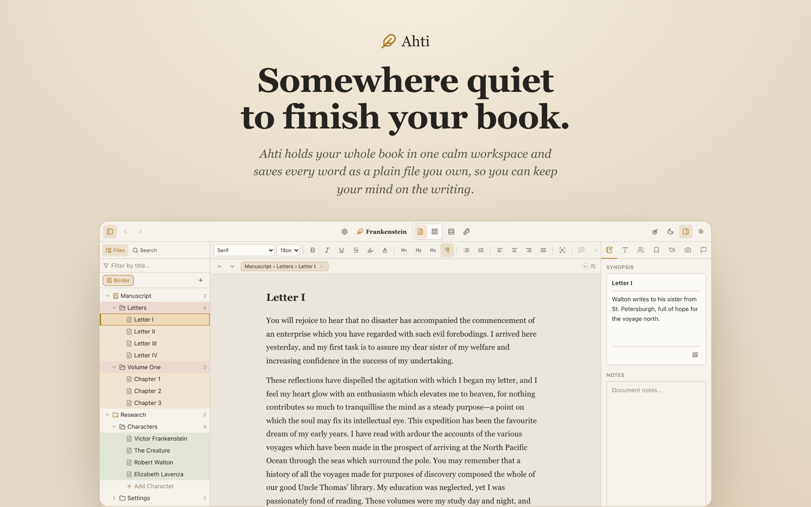
</p>

---

## Contents
1. [Overview](#overview)
2. [Screenshots](#screenshots)
3. [Features](#features)
4. [Technologies](#technologies)
5. [Architecture](#architecture)
6. [Challenges & solutions](#challenges--solutions)
7. [Shipping & numbers](#shipping--numbers)
8. [Process](#process)

---

## Overview

Ahti gives novelists, screenwriters, researchers, and anyone working on a big document a complete studio workflow — plus a few ideas borrowed from Obsidian: a plain-Markdown vault, `[[wiki-links]]`, and live hover previews.

**Your project is a plain folder.** Folders are real directories, documents are `NN Title.md` files (YAML frontmatter + Markdown body), folder metadata lives in `_index.md`, and the taxonomy lives in `.ahti/project.json`. Edit a file in Ahti, in Finder, or in any Markdown editor — the desktop app watches the vault and reflects external edits live. Nothing is locked in, and the save engine only ever rewrites files it created; it never deletes a file you added yourself.

```
The Salt Light/                       ← your vault folder
├── Manuscript/
│   ├── 01 Chapter One/
│   │   ├── _index.md                 ← the folder's synopsis/label/status
│   │   ├── 01 The Long Road.md       ← frontmatter + your prose
│   │   └── 02 The Keeper.md
│   └── 02 Chapter Two/ …
├── Research/   ·   Trash/
└── .ahti/
    ├── project.json                  ← labels, statuses, collections, targets
    └── snippets/*.css                ← optional per-vault CSS
```

**Privacy:** Ahti collects nothing, has no account, and works completely offline. Your writing stays in plain files on your device — and on your own iCloud if you turn it on.

---

## Screenshots

### macOS
| Editor | Corkboard |
|---|---|
| 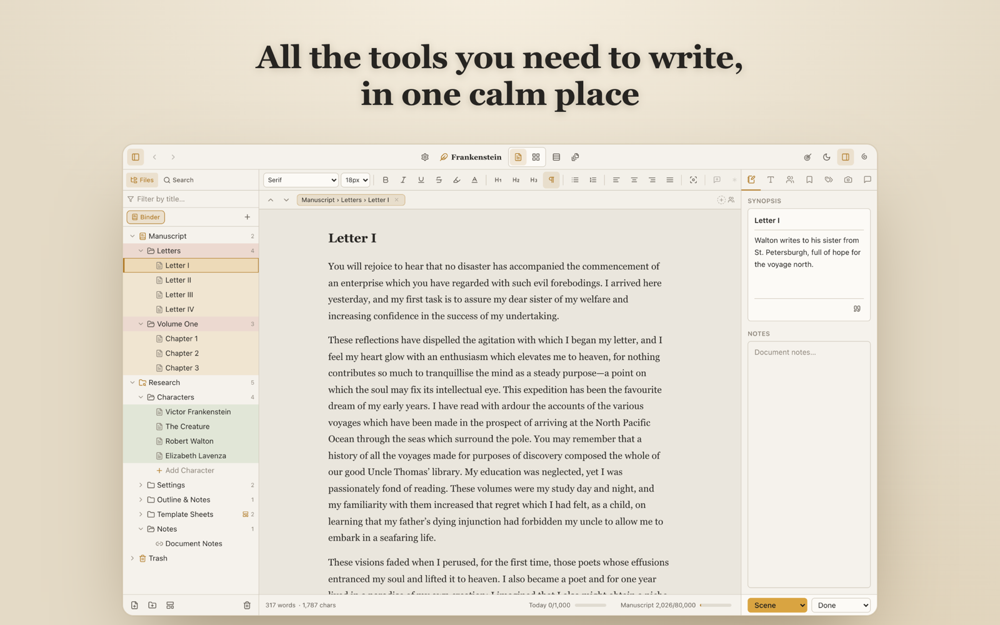 | 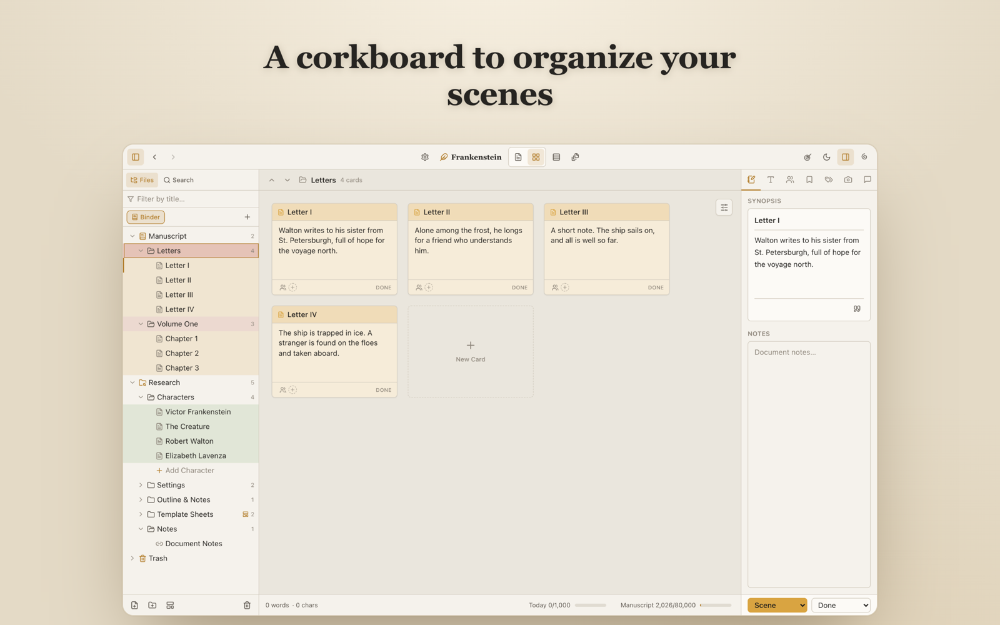 |

| Composition mode |
|---|
| 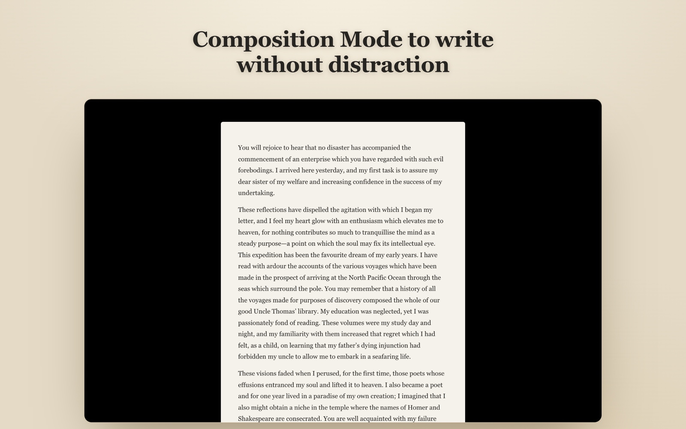 |

### iPad & iPhone
<p>
  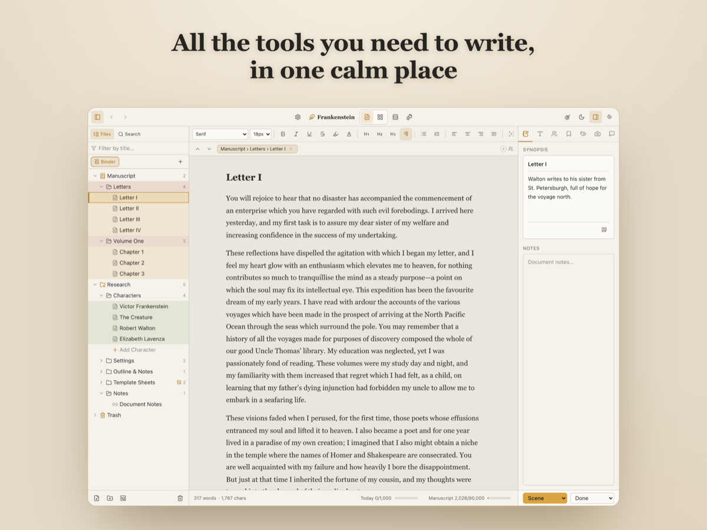
</p>
<p>
  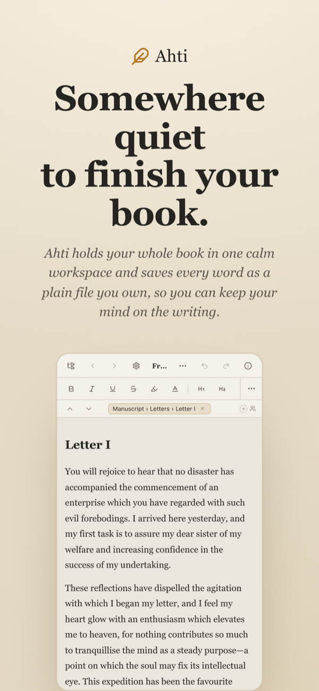
  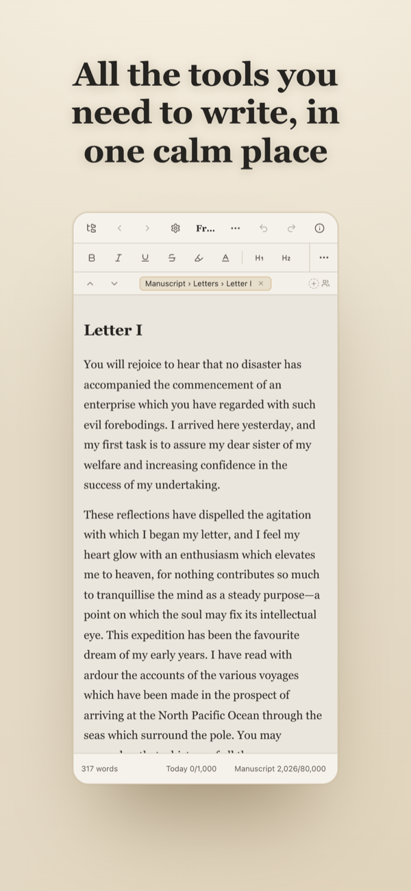
  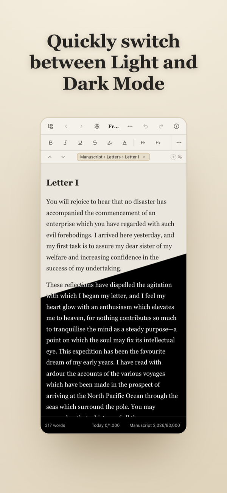
  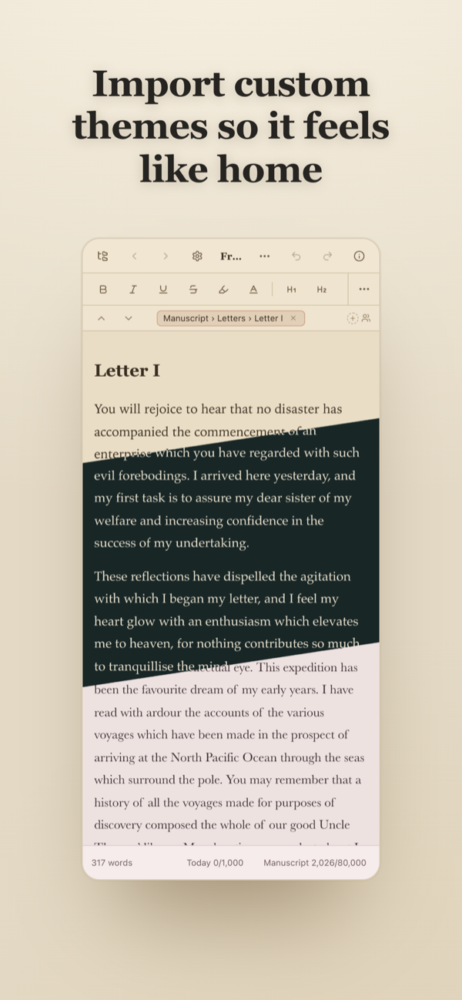
</p>

### Browser build (same codebase, IndexedDB-backed)
| Outliner | Corkboard |
|---|---|
| 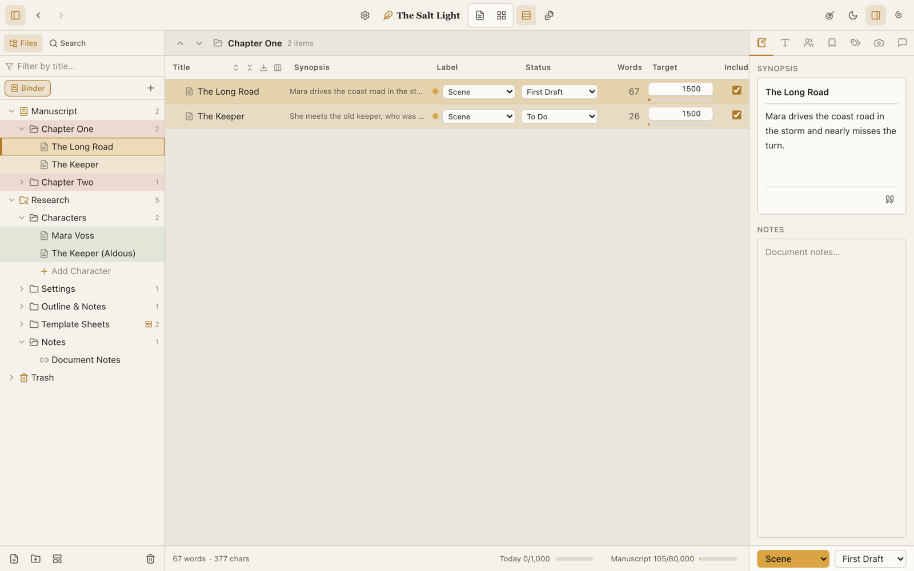 | 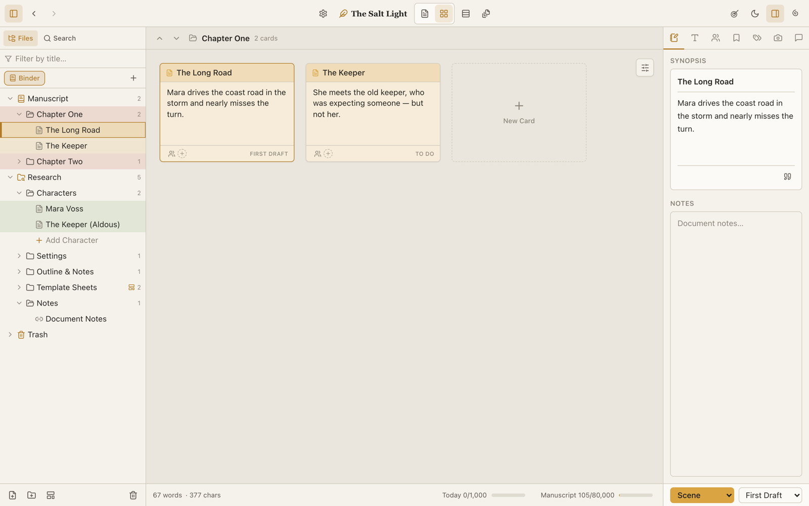 |

---

## Features

### Organize
- **Binder** — drag-and-drop hierarchical tree (Manuscript / Research / Trash roots) with custom icons, labels, statuses, inline rename, multi-select, copy/paste/duplicate, group/ungroup, sort, and import (files, OPML, "import & split").
- **Collections** — hand-curated lists *and* live saved-searches shown as colored tabs; read a collection as one continuous stream or view it as a corkboard/outliner.
- **Document links** — `[[wiki-links]]` with autocomplete, optional non-destructive title autolinking, and an Obsidian-style **hover preview** that opens a live, editable popover of the linked document.
- **Search & navigation** — project-wide full-text search (case / whole-word / regex), Quick Open (⌘P), arrow-key tree navigation, and browser-style Back/Forward history that remembers view changes.

### Write
- **Rich-text editor** (TipTap / ProseMirror) — full inline formatting, highlight and text color, headings, lists, quotes, code, page breaks, tables, images, alignment, indent and spacing controls.
- **Comments & footnotes** anchored to ranges, editable in the inspector, convertible to one another, collected at compile.
- **Named styles**, smart typography and text transforms, find-by-formatting, linguistic focus (tint a part of speech), and **focus mode** (dim everything but the current sentence/paragraph).
- **Continuous editing** of a whole folder as one manuscript, a **composition mode** for distraction-free writing, a **split editor**, and find/replace (document or project-wide).

### Plan
- **Corkboard** — index cards with synopses, label colors, status stamps, numbering and image cards; grid or freeform layout.
- **Outliner** — a spreadsheet of the manuscript with toggleable, reorderable, resizable columns, most editable inline.
- **Inspector** — synopsis & notes, format, characters, bookmarks, metadata & keywords, snapshots, comments & footnotes.
- **Character sheets** — add characters to a scene from a template picker (including TTRPG sheets), see stats inline, and roll dice (with optional 3D dice).

### Track & finish
- **Snapshots** — versioned copies of any document; browse, compare, restore, or rename project-wide.
- **Writing targets** — manuscript goal, auto-tracked daily goal with pace suggestions, deadline pacing; a **writing-history heatmap** and project statistics.
- **Compile** — flatten any folder or collection into **ePub, DOCX, RTF, HTML, Markdown, plain text, or print/PDF** with a live preview: title page, front/back matter, per-section-type layouts, chapter numbering, table of contents, replacements, ebook metadata, and saveable presets.

### Customize
- Tabbed settings (theme, accent, fonts, widths, formatting defaults, auto-backups), a metadata manager (labels, statuses, typed custom fields), per-vault **CSS snippets**, and per-area undo/redo routed by focus (editor, binder, inspector).

### On iOS
The full studio with a touch-native shell: finger-following drawers for the binder and inspector, a locked viewport with a custom keyboard accessory, a bottom formatting bar above the keyboard, press-and-hold drag-reorder, and iCloud-synced vaults.

---

## Technologies

React 18 · TypeScript · Vite · **Tauri 2 (Rust)** for macOS + iOS · Tailwind CSS · Zustand (immer) · TipTap / ProseMirror · dnd-kit · `notify` (file watching) · marked + js-yaml (Markdown/frontmatter) · localforage / IndexedDB (browser build) · `@3d-dice/dice-box` (WASM) · Objective-C++ (iOS shell) · objc2 Rust FFI (iCloud, security-scoped bookmarks) · Vitest · App Store Connect / TestFlight / Transporter

---

## Architecture

A single Zustand store is the source of truth, holding one `Project`; every UI surface reads and mutates through it, so components stay decoupled. Pure helpers (selectors, word counts, compile, persistence, seeding) live in a `lib/` layer with unit tests. **Persistence is pluggable:** the desktop and iOS apps read and write a Markdown vault on disk through native Rust commands with live file-watching; the browser build persists to IndexedDB and exports a single `.ahti.json`.

Comments and footnotes are editor marks that get stripped from the clean Markdown body and persisted as character-offset ranges in frontmatter, then re-anchored on load — so the `.md` files stay readable anywhere.

---

## Challenges & solutions

- **Mac App Store sandbox.** A sandboxed app can't freely read a folder the user picks, so vault access uses security-scoped bookmarks minted in Rust and resolved on relaunch. Three Transporter validation failures were chased down (app category, a missing `application-identifier` when signing manually, a quarantine xattr sealed into the bundle) — and then the nastiest one: the sandboxed build showed a **blank window** with no sandbox denial logged. Root cause: WKWebView's helper processes need the `network.client` entitlement to initialize, even though Ahti makes no network calls.
- **App Review rejection, root-caused.** Reviewers test a fresh container — the welcome screen, a state my own machines never showed. Registering a close handler routed every close through Tauri's `destroy` command, which needed a capability the app didn't grant; the red close button was silently dead. Fixed and verified by scripting the accessibility close button before and after.
- **The iOS keyboard.** WKWebView's `interactive-widget=resizes-content` proved unreliable, so the shell is pinned to the visual viewport with a fixed root; the outer scroll view is disabled and its offset held at zero from Objective-C++; a native keyboard-geometry bridge posts the keyboard's height and animation duration to JS so the caret lifts in lockstep with the keyboard. A background-task guard protects in-flight saves when the app backgrounds.
- **A fade that wouldn't animate.** Focus mode dims blocks with editor decorations, but ProseMirror creates the dimmed DOM in the same commit as the decoration, so a CSS transition has no "before" frame. After three transition-based attempts, a keyframe animation fixed it — verified in real WebKit with a Playwright harness.
- **Performance at book scale.** Continuous editing virtualizes above 30 scenes: off-screen scenes render as pixel-identical static HTML — roughly 98% fewer live editors and half the heap on a 220-scene manuscript.
- **Reliability audit.** A two-round adversarial audit found and fixed **283 verified bugs**, including two silent-failure classes: browser dialogs (`alert`/`confirm`/`prompt`) and `<a download>` are no-ops inside the WebView (replaced with in-app dialog/save/open infrastructure), and non-atomic vault writes (now temp-file + rename, covered by Rust tests). Also added a real Content Security Policy, a single-instance lock, and WebView process-death recovery.

---

## Shipping & numbers

- First commit **June 15, 2026** → **v1.1.1 on July 6, 2026** (157 commits in three weeks).
- ~43k lines of TypeScript across ~200 files, plus a Rust layer; **530 unit tests (Vitest) + Rust tests**.
- First signed TestFlight build June 18; 1.0.0 submitted June 25; iOS approved; macOS 1.0.0 rejected → fixed in 1.0.1 (July 1); 1.1.0 released to both stores July 5. One App Store Connect record (Universal Purchase, `com.ahti.app`).
- Support, privacy, and documentation site built and deployed for App Review.

---

## Process

Built solo, with Claude Code as a pair-programmer: I set the design constraints (plain-Markdown vault, no lock-in, offline-first, "quiet" UI), owned the architecture and the review/verification loops, tested on real devices, and handled signing, entitlements, App Review, and release.

---

*Bret Merritt · [GitHub](https://github.com/bretm9) · [LinkedIn](https://www.linkedin.com/in/bret-merritt) · merrittbret9@gmail.com*
